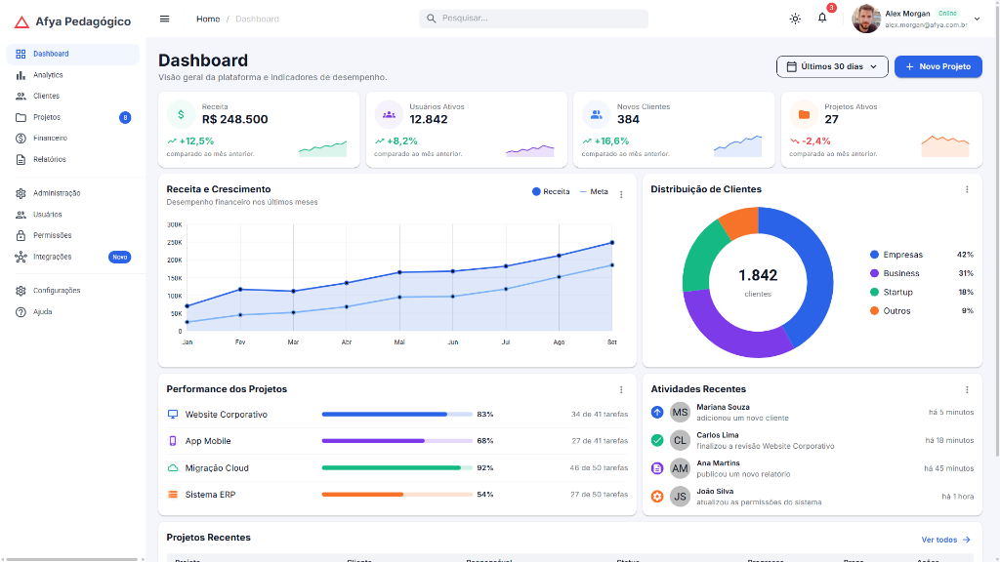
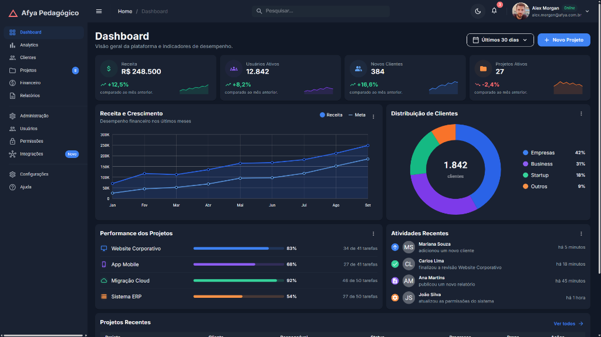
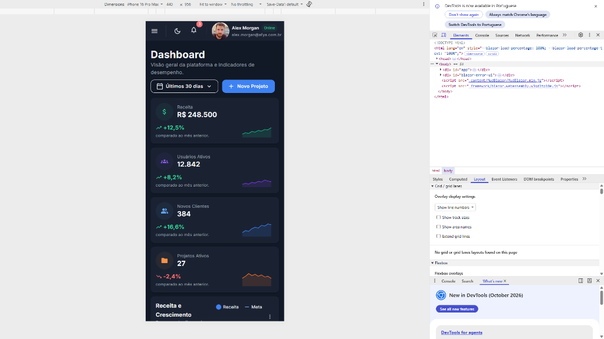
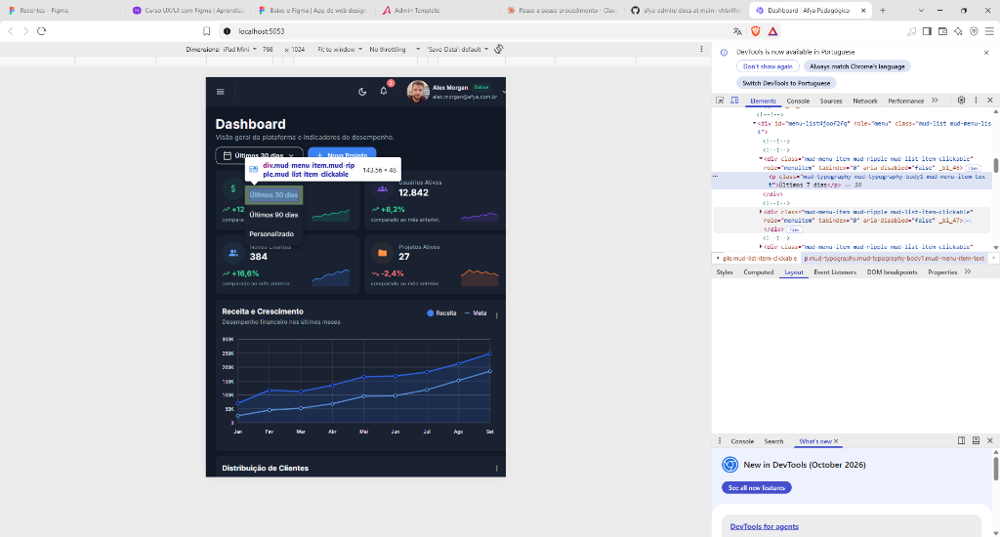

# Afya Admin — Dashboard com Blazor WebAssembly e MudBlazor

## Identificação

| | |
|---|---|
| **Aluno(a)** | Victor Hugo Brilhante Bezerra dos Santos |
| **Matrícula** | 2631982 |
| **Faculdade** | Afya São Lucas |
| **Curso** | Ciências da Computação |
| **Disciplina** | Programação para sistemas web |
| **Professor(a)** | Liluyoud |
| **Semestre** | 2026.2 |

## Objetivo do projeto

O Afya Admin é uma aplicação web do tipo Single Page Application (SPA) desenvolvida para atuar como um painel de controlo administrativo moderno e responsivo. O objetivo principal do projeto é aplicar os conceitos de construção de interfaces ricas, componentização reutilizável, manipulação de estados e layout reativo no ecossistema .NET com Blazor WebAssembly e MudBlazor.

A página principal do sistema consolida e exibe indicadores-chave de desempenho (KPIs), tais como métricas financeiras, contagem de utilizadores ativos, total de vendas e taxa de conversão. Além disso, a tela oferece filtros dinâmicos por período e tabelas organizadas com dados estatísticos da aplicação (como a listagem de projetos recentes) para auxílio na tomada de decisões.

Todo o processamento e a renderização ocorrem diretamente no navegador do cliente via WebAssembly. Isso garante alta performance, transições instantâneas entre telas e navegação fluida sem a necessidade de recarregar a página (*page refresh*) a cada interação, incluindo a alternância dinâmica entre os temas claro e escuro.

## Tecnologias utilizadas

- .NET 10 / Blazor WebAssembly
- MudBlazor 9
- C# 14 / HTML5 / CSS3
- Git & GitHub

## Como executar

Pré-requisitos:
- **.NET SDK 10.0** (ou superior) instalado na máquina.
- Navegador moderno compatível com WebAssembly (Chrome, Edge, Firefox, Brave, Safari).

Passo a passo para clonar e rodar o projeto:

```bash
git clone https://github.com/vhbrilhante/afya-admin.git
cd afya-admin
dotnet watch
```

Após a compilação, a aplicação abrirá automaticamente no navegador no endereço local `http://localhost:5053`.

---

## 📸 Telas

### Tema claro


### Tema escuro


### Versão mobile


### HTML gerado (DevTools)


O print do DevTools demonstra a inspeção do componente KpiCard (cartão de métricas estatísticas). O código C#/Blazor compilado foi traduzido no navegador em elementos HTML nativos, exibindo a tag `<div class="mud-paper mud-paper-outlined pa-4">` e elementos de tipografia `<h4 class="mud-typography mud-typography-h4">`. Isso comprova que os componentes da biblioteca MudBlazor são convertidos em marcação HTML padrão estilizada com classes utilitárias baseadas em Material Design, sem a necessidade de escrever CSS manualmente.

---

## 📂 Estrutura do projeto

```text
afya-admin/
├── Components/
├── Data/
├── Layout/
├── Pages/
├── Properties/
├── docs/
│   └── prints/
├── wwwroot/
├── _Imports.razor
├── App.razor
├── Program.cs
└── afya-admin.csproj
```

- **Components/**: Armazena os componentes visuais reutilizáveis e customizados da interface (ex: `KpiCard.razor`, `DashboardCard.razor`, `ProjetosRecentes.razor`, `SeletorPeriodo.razor`).
- **Data/**: Contém os modelos de dados (DTOs/Entities) e os serviços de simulação (mocks) para fornecimento de informações ao dashboard.
- **Layout/**: Define a estrutura visual global e fixa da aplicação (`MainLayout.razor`), como a barra superior, menu lateral e alternância de temas.
- **Pages/**: Guarda os componentes que possuem a diretiva `@page` e funcionam como telas acessíveis por rotas de URL (ex: `Dashboard.razor`).
- **Properties/**: Contém as configurações de perfil de inicialização do ambiente de desenvolvimento (`launchSettings.json`).
- **docs/prints/**: Armazena as capturas de tela (screenshots) e imagens utilizadas na documentação do repositório.
- **wwwroot/**: Concentra os ficheiros estáticos públicos acessados pelo navegador (`index.html`, ícones e estilos globais).

---

## 🧩 Componentes criados

| Componente | Responsabilidade | Parâmetros que recebe |
| :--- | :--- | :--- |
| `DashboardCard` | Contêiner genérico e estilizado para agrupar blocos de conteúdo visual no painel. | `string Titulo`, `RenderFragment ChildContent` |
| `KpiCard` | Exibe cartões de métricas individuais com valor numérico, variação percentual e ícone de destaque. | `string Titulo`, `string Valor`, `string CorIcone`, `string Porcentagem` |
| `ProjetosRecentes` | Monta uma tabela de dados (`MudTable`) listando os últimos projetos cadastrados no sistema. | Nenhum (consome os dados diretamente do serviço injetado na pasta Data). |
| `SeletorPeriodo` | Componente de formulário para seleção e filtragem do intervalo de datas/período exibido no painel. | `string Valor`, `EventCallback<string> ValorChanged` |

---

## 🧠 O que aprendi

**1. Como uma aplicação Blazor WebAssembly inicia no navegador? Qual é o papel do `index.html`, da `<div id="app">` e do `Program.cs`?**

O navegador carrega primeiramente o arquivo `wwwroot/index.html`, que descarrega o runtime do .NET compilado em WebAssembly. A `<div id="app">` funciona como o ponto de ancoragem onde toda a árvore de componentes da interface será injetada. O `Program.cs` é executado na inicialização client-side para registrar serviços no contêiner de injeção de dependência e instanciar o componente raiz na div `#app`.

**2. Qual é a diferença entre um Layout, uma Page e um Component neste projeto? Dê um exemplo de cada.**

O Layout (`MainLayout.razor`) é a estrutura de suporte fixa mantida entre as navegações (contendo o menu lateral e o topo); a Page (`Home.razor`) representa uma tela completa associada a uma rota de navegação específica; e o Component (`KpiCard.razor`) é um bloco visual isolado e reutilizável que pode ser inserido dentro de várias páginas ou layouts.

**3. O que é um `RenderFragment` e como o `DashboardCard` usa esse recurso para ser reutilizado por vários cards?**

Um `RenderFragment` é um parâmetro especial do Blazor que representa um trecho de marcação HTML/Razor passado de um componente pai para um filho. O `DashboardCard` possui a propriedade `ChildContent` do tipo `RenderFragment`, permitindo que qualquer elemento (como tabelas ou textos) seja inserido dinamicamente dentro da sua estrutura estilizada.

**4. Como funciona o `@bind-Valor` no `SeletorPeriodo`? Qual é o papel do `ValorChanged`?**

O `@bind-Valor` implementa a ligação bidirecional de dados (two-way data binding). A propriedade `Valor` armazena o valor selecionado vindo do pai, enquanto o `ValorChanged` (do tipo `EventCallback`) dispara um evento para notificar o componente pai imediatamente após qualquer alteração feita pelo utilizador, mantendo o estado sincronizado.

**5. Por que os dados ficam na pasta `Data`, separados dos componentes? Que vantagem isso traz se, no futuro, os dados vierem de uma API?**

Essa separação segue o princípio da responsabilidade única, isolando a camada de apresentação do fornecimento de informações. Caso a aplicação passe a consumir dados de uma API REST no futuro, bastará alterar os serviços da pasta `Data` (injetando o `HttpClient`) sem necessidade de modificar a lógica visual dos componentes.

**6. Como o `MudGrid` com `xs`, `sm` e `lg` faz os cards de KPI se reorganizarem em telas de tamanhos diferentes?**

O `MudGrid` utiliza um sistema de grelha responsiva baseado em 12 colunas flexíveis. Ao definir `xs="12"`, `sm="6"` e `lg="3"` nos itens, o card ocupará a largura total (12 colunas) em telemóveis (`xs`), metade da tela (6 colunas) em tablets (`sm`) e um quarto da largura (3 colunas) em monitores grandes (`lg`).

**7. Como foi possível estilizar a página inteira sem escrever CSS? Explique o papel do tema (`MudTheme`) e das classes utilitárias.**

A estilização foi realizada através do ecossistema do MudBlazor. O componente `MudThemeProvider` aplica um objeto `MudTheme` global contendo as definições de cores primárias, secundárias e o tema claro/escuro em C#. O ajuste fino de layout foi feito via classes utilitárias pré-definidas (como `pa-4` para padding e `d-flex` para flexbox), dispensando a escrita de ficheiros CSS manuais.

**8. Por que o namespace do projeto é `afya_admin` e não `afya-admin`?**

Nas regras da linguagem C#, os identificadores de namespaces não podem conter hifens (`-`), pois o hífen é reservado como o operador aritmético de subtração. Por esse motivo, o compilador do .NET substitui o hífen do nome do projeto por um sublinhado (`_`), resultando no namespace `afya_admin`.

---

## ⚠️ Dificuldades e soluções

- **Comando `dotnet` não reconhecido no terminal**: Ao tentar executar o projeto com `dotnet watch`, o terminal retornou erro informando que o comando não era reconhecido. **Solução**: Foi realizada a instalação do .NET SDK 10 no sistema operacional e o terminal foi reiniciado para que as variáveis de ambiente (PATH) fossem atualizadas corretamente.

- **Componentes sem estilização no carregamento inicial**: Inicialmente os componentes do MudBlazor eram exibidos sem qualquer estilo na tela. **Solução**: Identificou-se a ausência do arquivo de estilos da biblioteca no `wwwroot/index.html` e adicionaram-se as referências estáticas do CSS (`_content/MudBlazor/MudBlazor.min.css`) e do JavaScript da dependência.

---

## 🔮 Melhorias futuras

- **Consumo de API Real**: Substituição dos dados simulados na pasta `Data/` por integração HTTP com uma API ASP.NET Core externa.
- **Módulo de Gestão de Utilizadores**: Criação de tela complementar com tabela de dados (`MudDataGrid`), suporte à paginação, ordenação e pesquisa rápida.
- **Persistência de Tema**: Salvamento da preferência do tema (Claro/Escuro) no `LocalStorage` do navegador para manter a escolha entre sessões.
